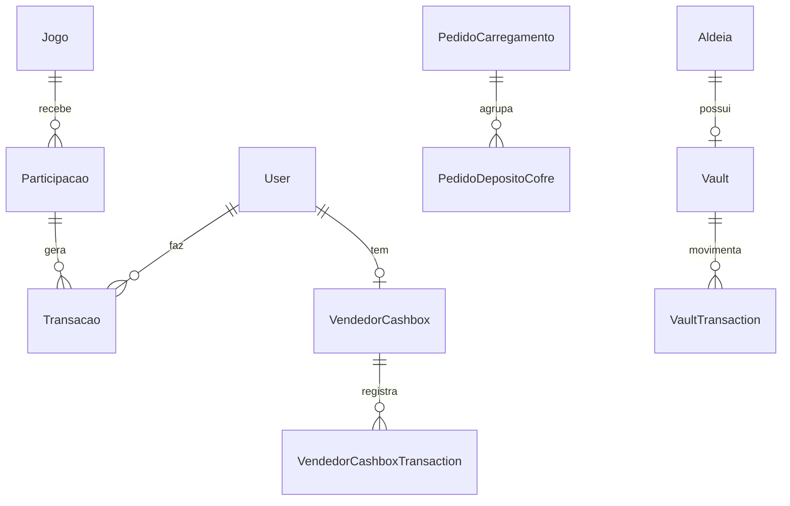

# Análise Completa do Backend, Dependências, Segurança e Fluxo Financeiro — Aldeias_Games

> **Data:** 2026-07-16  
> **Objetivo:** Auditoria profunda do backend (API routes, Prisma schema, libs, middleware), dependências (package.json), segurança (auth, RBAC, rate limiting, validações, webhooks) e **rastreabilidade total do dinheiro** (wallet, cashbox, vault, transações, comissões, carregamentos, depósitos cofre).

---

## 1. ARQUITETURA DO BACKEND

### 1.1 Estrutura de Rotas API (109 endpoints)
```
src/app/api/
├── admin/                    # Gestão aldeias, utilizadores, auditoria, entregas
├── aldeia/                   # CRUD aldeias, membros, roles
├── aldeias/                  # Listagem pública, join aldeia
├── analytics/                # Dashboard, eventos de jogo, preditiva
├── apostas/                  # Apostas Poio da Vaca (legacy/novo)
├── auth/                     # Login, register, 2FA, refresh, reset, verify, OAuth
├── backup/                   # Backup/restore BD
├── carregamento/             # Top-ups saldo jogador (QR + password one-time)
├── cofre/                    # Vault system: histórico, levantamento, pedido-depósito, reconciliação, resumo
├── comissoes/                # Gestão comissões vendedores
├── dashboard/                # Stats agregadas
├── euromilhoes/              # Grelhas, sorteios
├── eventos/                  # CRUD eventos, templates, recorrência
├── export/                   # CSV participações, relatórios, vendas
├── financeiro/               # Visão financeira aldeia
├── health/                   # Health check
├── jogos/                    # CRUD jogos, validação rentabilidade, hash verificação
├── mbway/                    # Pagamento, status, webhook
├── me/                       # Perfil utilizador autenticado
├── notificacoes/             # CRUD notificações (polling 30s)
├── pagamentos/               # Stripe checkout, intent, webhook
├── participacoes/            # Criação/listagem participações (GameHandler pattern)
├── pedidos-carregamento/     # Aprovação top-ups vendedor
├── planos/                   # Planos SaaS aldeias
├── public/                   # Stats públicas, jogos ativos
├── push/                     # Subscriptions push
├── ranking/                  # Leaderboards
├── rbac/                     # Roles, permissions, matrix
├── rgpd/                     # Consentimentos, direito esquecimento
├── setup-status/             # Wizard onboarding aldeia
├── sorteios/                 # Commit-reveal, verificação
├── stripe/                   # Checkout, webhook, customer, subscription
├── superadmin/               # Vista global aldeias, cofre global
├── users/                    # Gestão utilizadores admin
├── vendedor/                 # Dashboard vendedor específico
├── vendedores/               # CRUD vendedores
└── wallet/                   # Saldo, transações, histórico prémios
```

### 1.2 Padrões Arquiteturais Identificados

| Padrão | Onde Aplicado | Qualidade |
|--------|---------------|-----------|
| **GameHandler Strategy** | `participacoes/_lib/*.ts` (raspadinha, rifa, poio, euromilhoes) | ✅ Extensível, isolado |
| **Transações Atómicas Prisma** | `participacoes/route.ts`, `apostas/route.ts`, `cofre/pedido-deposito/[id]/route.ts` | ✅ Race condition protection |
| **Validação Zod + Sanitização** | Todas as rotas POST/PUT | ✅ Consistente |
| **Audit Log Centralizado** | `lib/audit.ts` + helpers (`logJogoWrite`, `logSorteio`, etc.) | ✅ Rastreável |
| **RBAC Middleware + Client Guards** | `middleware.ts` (rate limit only), `lib/auth.ts` (`hasRole`), `components/auth/RoleGuard` | ⚠️ Middleware incompleto |
| **Refresh Token Rotation** | `lib/auth.ts` (7 dias, revogação, rotação) | ✅ Boa prática |
| **Cookie httpOnly + SameSite** | Access token (24h, lax), Refresh token (7d, strict, path `/api/auth`) | ✅ Seguro |

---

## 2. DEPENDÊNCIAS (package.json)

### 2.1 Produção (principais)
```json
{
  "next": "16.2.7",
  "react": "19.0.0",
  "react-dom": "19.0.0",
  "@prisma/client": "6.19.3",
  "next-auth": "5.0.0-beta.25",  // NÃO USADO (auth próprio)
  "jose": "5.9.6",                // JWT HS256
  "bcryptjs": "2.4.3",            // Password hash
  "zod": "3.24.2",                // Validação
  "stripe": "16.12.0",            // Pagamentos cartão
  "axios": "1.7.7",               // MBWay HTTP client
  "crypto": "node:crypto",        // Hashes, HMAC, random
  "@radix-ui/*": "latest",        // Acessíveis (Dialog, Select, etc.)
  "sonner": "1.5.0",              // Toasts
  "framer-motion": "11.3.30",     // Animações
  "lucide-react": "0.475.0",      // Ícones
  "date-fns": "3.6.0",            // Datas PT-PT
  "canvas-confetti": "1.9.3",     // Vitória raspadinha
  "qrcode": "1.5.4",              // QR carregamentos
  "jspdf": "2.5.1", "jspdf-autotable": "3.8.2", // PDF/CSV export
  "socket.io": "4.7.5",           // Real-time (não usado ativamente)
  "web-push": "3.6.7"             // Push notifications
}
```

### 2.2 Desenvolvimento
```json
{
  "typescript": "5.6.2",           // strict: false ⚠️
  "prisma": "6.19.3",              // Pinned (Vercel build)
  "vitest": "2.1.3",               // Configurado mas 0 testes
  "playwright": "1.47.0",          // Configurado mas 0 testes E2E
  "eslint": "9.10.0",              // NÃO CONFIGURADO ❌
  "prettier": "3.3.3",             // NÃO CONFIGURADO ❌
  "@types/*": "em dependencies"    // ⚠️ Deveriam estar em devDependencies
}
```

### 2.3 Alertas de Dependências
| Problema | Severidade | Ação |
|----------|------------|------|
| `@types/*` em `dependencies` | 🟡 Médio | Mover para `devDependencies` |
| `next-auth` instalado mas não usado | 🟡 Médio | Remover ou migrar |
| `eslint`, `prettier` ausentes | 🟠 Alto | Configurar + `lint-staged` |
| `typescript: { strict: false }` | 🔴 Crítico | Ativar `strict: true` gradualmente |
| `ignoreBuildErrors: true` no next.config.js | 🔴 Crítico | Remover + corrigir erros TS |
| `socket.io`, `web-push` não usados | 🟢 Baixo | Remover se não planeados |

---

## 3. SEGURANÇA DA APLICAÇÃO

### 3.1 Autenticação & Sessão (`lib/auth.ts`)

| Mecanismo | Implementação | Status |
|-----------|---------------|--------|
| **Password Hash** | bcrypt cost 10 | ✅ Adequado |
| **JWT Access Token** | HS256, 24h, payload: userId, email, role, aldeiaId | ✅ Curto prazo |
| **JWT Secret** | `process.env.JWT_SECRET` **obrigatório** (throw se missing) | ✅ Sem fallback |
| **Refresh Token** | 40 bytes hex, 7 dias, armazenado em BD (`RefreshToken` model), rotação + revogação | ✅ Robusto |
| **Cookies** | Access: httpOnly, secure(prod), sameSite=lax, maxAge=24h<br>Refresh: httpOnly, secure(prod), sameSite=strict, path=/api/auth, maxAge=7d | ✅ Boas práticas |
| **2FA (TOTP)** | Obrigatório para `super_admin` e `aldeia_admin`, `speakeasy` TOTP, QR setup | ✅ Implementado |
| **Account Lockout** | 5 falhas → 15 min bloqueio, reset em login sucesso | ✅ Proteção brute-force |
| **Email Verification** | Obrigatório antes de login | ✅ |
| **OAuth** | Google + Apple (PKCE implícito via redirect) | ✅ Disponível |
| **Demo Users** | Hardcoded em `login/route.ts` com `ENABLE_DEMO_USERS` env guard | ⚠️ Só dev |

### 3.2 Autorização (RBAC)

```typescript
// lib/auth.ts:218-223
export function hasRole(userRole: string, allowedRoles: string[]): boolean {
  return allowedRoles.includes(userRole);
}
```

**Hierarquia de Roles:**
```
super_admin  → tudo, todas aldeias
aldeia_admin → própria aldeia (eventos, jogos, users, cofre, financeiro)
vendedor     → próprias vendas, cashbox, pedidos carregamento/depósito
user         → próprias participações, wallet, perfil
```

**Isolamento por Aldeia (multi-tenant):**
- Middleware **NÃO** faz RBAC (só rate limit)
- Cada rota API valida `user.aldeiaId` vs recurso (`jogo.evento.aldeiaId`, `aldeiaId` direto)
- `getFullUserFromRequest` resolve `aldeiaId` via `userAldeiaRoles` fallback

**Gaps RBAC:**
| Gap | Impacto | Ficheiro |
|-----|---------|----------|
| Middleware não bloqueia rotas por role | UI pode mostrar, API bloqueia — OK mas confuso | `middleware.ts` |
| `RoleGuard` client-side só redireciona | Não é barreira real | `components/auth/RoleGuard.tsx` |
| Permissões granulares (PermissionKey) definidas mas **não usadas nas APIs** | Over-engineering não aproveitado | `prisma/schema.prisma:720-748` |

### 3.3 Rate Limiting (`lib/rate-limit.ts` + `middleware.ts`)

| Endpoint | Limite | Janela | Store |
|----------|--------|--------|-------|
| `/api/auth/login` | 5 req | 15 min | **Map em memória** ❌ |
| `/api/auth/register` | 3 req | 1 h | **Map em memória** ❌ |
| `/api/auth/forgot-password` | 3 req | 1 h | **Map em memória** ❌ |
| `/api/pagamentos/stripe` | 10 req | 1 min | **Map em memória** ❌ |
| `/api/pagamentos/mbway` | 10 req | 1 min | **Map em memória** ❌ |
| `/api/participacoes` | 20 req | 1 min | **Map em memória** ❌ |

**Problema Crítico:** `RateLimit` model existe no Prisma mas **middleware usa Map em memória** → perde estado em restart, não escala (Vercel serverless).  
**Fix:** Usar `prisma.rateLimit` ou Vercel KV/Upstash Redis.

### 3.4 Validação & Sanitização

| Camada | Ferramenta | Cobertura |
|--------|------------|-----------|
| **Schema** | Zod (`lib/validations.ts`) | 100% rotas POST/PUT |
| **Sanitização HTML** | `escapeHtml` (`lib/utils.ts`) em `nomeCliente`, `dadosParticipacao` | ✅ XSS prevention |
| **Telefone PT** | Regex `^(\+|00)351?9\d{8}$` + normalização | ✅ |
| **Password Policy** | 12 chars, 1 maiúscula, 1 minúscula, 1 dígito, 1 especial | ✅ Forte |
| **File Upload** | Não há upload direto (logoBase64 string) | ✅ Sem risco |

### 3.5 Headers Segurança (`next.config.js`)

```javascript
headers: [
  'X-Content-Type-Options: nosniff',
  'X-Frame-Options: DENY',
  'X-XSS-Protection: 1; mode=block',
  'Referrer-Policy: strict-origin-when-cross-origin',
  'Permissions-Policy: camera=(), microphone=(), geolocation=()',
  'Strict-Transport-Security: max-age=31536000; includeSubDomains',
  // CSP PROBLEMÁTICO:
  'Content-Security-Policy: script-src \'self\' \'unsafe-inline\' \'unsafe-eval\' ...'
]
```

**CSP com `unsafe-inline` + `unsafe-eval`** → **🔴 Crítico** — permite XSS se houver injection.  
**Fix:** Nonces para scripts inline, remover `unsafe-eval` (Next.js 16 não precisa).

### 3.6 Webhooks Pagamentos

| Provider | Verificação Assinatura | Status |
|----------|------------------------|--------|
| **Stripe** | `stripe.webhooks.constructEvent(payload, sig, secret)` em `stripe.ts:106-112` | ✅ Implementado |
| **MBWay** | HMAC-SHA256 `validateWebhookSignature` em `mbway.ts:272-297` | ✅ Implementado |

---

## 4. FLUXO FINANCEIRO — RASTREABILIDADE TOTAL DO DINHEIRO

### 4.1 Modelos Financeiros Principais (Prisma)



#### 4.1.1 **Player Wallet** (`User.saldo`)
- **Entradas:** Top-up (MBWay/Stripe/dinheiro), Cashback 5% (configurável), Prémio conversão, Comissão vendedor
- **Saídas:** Participação jogos (saldo), Transferência admin→vendedor
- **Auditoria:** `Transacao` com `tipo`, `valor`, `referencia`, `descricao`, `dadosAdicionais`

#### 4.1.2 **Vendedor Cashbox** (`VendedorCashbox`)
- **Finalidade:** Dinheiro físico que vendedor recolhe de jogadores (pagamento `dinheiro`)
- **Fluxo:**
  1. Jogador paga `dinheiro` → `Participacao.estadoPagamento = 'concluido'` + `VendedorCashbox.saldo += valor` (em `participacoes/route.ts:396-431`)
  2. Vendedor cria `PedidoDepositoCofre` → admin confirma → `Cashbox -= valor` + `Vault += valor`
- **Transações:** `VendedorCashboxTransaction` (tipo `RECEBIDO_DO_JOGADOR` | `DEPOSITADO_NO_COFRE` | `LEVANTAMENTO_COFRE`)

#### 4.1.3 **Vault (Cofre da Aldeia)** (`Vault` + `VaultTransaction`)
- **Finalidade:** Caixa forte da aldeia — dinheiro confirmado depositado pelos vendedores
- **Estados:** `pendente` → `confirmado` | `rejeitado` | `cancelado`
- **Rastreabilidade:** `criadoPorId`, `aprovadoPorId`, `referencia` (PedidoDepositoCofre ID), `dataAprovacao`

#### 4.1.4 **Carregamentos** (`PedidoCarregamento`)
- Jogador solicita top-up → gera QR + password one-time (15 min)
- Vendedor valida QR/password → confirma → `User.saldo += valor` + `Transacao(tipo='carregamento_saldo')`
- **Anti-fraude:** Max 3 pendentes/15min, password único, expiração, IP/dispositivo logado

#### 4.1.5 **Depósitos Cofre** (`PedidoDepositoCofre`)
- Vendedor agrupa vários `PedidoCarregamento` → cria pedido depósito
- Admin aldeia confirma → transação atómica:
  - `VendedorCashbox -= valor`
  - `Vault += valor`
  - `VaultTransaction(tipo='deposito', estado='confirmado')`
  - `VendedorCashboxTransaction(tipo='DEPOSITADO_NO_COFRE')`
  - Notificações vendedor + audit log

#### 4.1.6 **Comissões Vendedor** (`User.comissaoPercentual`, `comissaoTotal`, `Comissao` model)
- Configurável por vendedor (default 10%)
- Calculada em `participacoes/route.ts` venda interna (`isVendaInterna`)
- `Transacao(tipo='comissao')` creditada ao vendedor

---

### 4.2 Fluxos Completos de Dinheiro

#### 4.2.1 **Jogador → Participação (Saldo)**
```
User.saldo (50€) 
  → POST /api/participacoes { metodoPagamento: 'saldo', quantidade: 2, jogo.preco: 5€ }
  → Transação atómica:
     - Jogo.stockAtual -= 2
     - Jogo.totalAngariado += 10€
     - User.saldo -= 10€
     - Transacao(valor: -10, tipo: 'pagamento_jogo')
     - Transacao(valor: +0.50, tipo: 'cashback')  // 5%
  → Participacao.estadoPagamento = 'concluido'
```
✅ **Rastreável:** `Participacao` + `Transacao` + `Jogo.totalAngariado` + `User.saldo`

#### 4.2.2 **Jogador → Participação (Dinheiro via Vendedor)**
```
Jogador entrega 10€ dinheiro a Vendedor
  → Vendedor cria Participacao { metodoPagamento: 'dinheiro', pago: true }
  → Transação atómica (participacoes/route.ts:396-431):
     - Jogo.stockAtual--
     - VendedorCashbox.saldo += 10€
     - VendedorCashboxTransaction(tipo='RECEBIDO_DO_JOGADOR', +10€)
     - Transacao(vendedor, tipo='recebimento_vendedor', +10€)
     - Comissão vendedor (se venda interna) → User.saldo += comissão
```
✅ **Rastreável:** `Participacao` + `VendedorCashbox` + `VendedorCashboxTransaction` + `Transacao` + `Comissao`

#### 4.2.3 **Vendedor → Cofre (Depósito)**
```
Vendedor tem Cashbox 150€
  → POST /api/cofre/pedido-deposito { valor: 100€ }
  → PedidoDepositoCofre(estado='pendente')
  → Admin aldeia PUT /api/cofre/pedido-deposito/[id] { acao: 'confirmar' }
  → Transação atómica (route.ts:35-88):
     - Cashbox.saldo -= 100€  (valida saldo suficiente)
     - CashboxTransaction(tipo='DEPOSITADO_NO_COFRE', -100€)
     - Vault.upsert(saldo += 100€)
     - VaultTransaction(tipo='deposito', estado='confirmado', +100€)
     - Notificação vendedor + Audit log
```
✅ **Rastreável:** `PedidoDepositoCofre` + `VendedorCashbox` + `Vault` + `VaultTransaction` + `CashboxTransaction` + `AuditLog`

#### 4.2.4 **Levantamento Cofre → Conta Bancária**
```
Admin POST /api/cofre/levantamento { valor, iban, descricao }
  → VaultTransaction(tipo='levantamento', estado='pendente')
  → Super Admin aprova → estado='confirmado', Vault.saldo -= valor
  → Transferência bancária manual (fora sistema)
  → Audit log completo
```

#### 4.2.5 **Prémio → Jogador (Claim)**
```
Jogador ganha raspadinha 50€
  → POST /api/participacoes/[id]/claim-premio
  → Verifica hashRaspe + seedRaspe + grid (provably fair)
  → User.saldo += 50€
  → Transacao(tipo='premio_dinheiro', +50€)
  → Participacao.premioEntregue = true
```
✅ **Provably Fair:** `seedRaspe` + `hashRaspe` (SHA256 commit-reveal) em `lib/raspadinha.ts`

---

### 4.3 Pagamentos Externos (Stripe + MBWay)

| Método | Fluxo | Webhook | Reconciliação |
|--------|-------|---------|---------------|
| **Stripe** | Checkout Session → `success_url` → webhook `checkout.session.completed` | `stripe.ts:106-112` verifica assinatura | `Participacao.referenciaPagamento = session_id`, webhook atualiza `estadoPagamento='concluido'` |
| **MBWay** | `initiatePayment` → push notificação → polling `GET /api/pagamentos/mbway?transactionId=` | `mbway.ts:272-297` HMAC-SHA256 | `Participacao.referenciaPagamento = transactionId`, webhook/GET atualiza estado |

**Gaps:**
- Stripe webhook **não idempotente** (pode processar duplicados se retry)
- MBWay sandbox simula — produção precisa credenciais reais SIBS

---

### 4.4 Auditoria Financeira (Comprovável)

| Evento | Audit Log (`AuditLog` model) | Detalhes |
|--------|-----------------------------|----------|
| Criação jogo | `logJogoWrite` | userId, jogoId, campos, IP, UA |
| Sorteio commit/reveal | `logSorteio` | seed, hash (truncados), vencedores |
| Conversão prémio | `logPremioConvertido` | participacaoId, valor |
| Depósito cofre confirmado | `logAudit` em `cofre/pedido-deposito/[id]` | valor, vendedor, admin, IP |
| Carregamento confirmado | `logAudit` em `carregamento/[id]/confirmar` | valor, jogador, vendedor |
| Levantamento cofre | `logAudit` | valor, IBAN (hash?), admin |

**Queries úteis para reconciliação:**
```sql
-- Saldo total aldeia (Wallet + Cashbox + Vault)
SELECT a.nome,
       SUM(u.saldo) as wallets,
       SUM(vc.saldo) as cashboxes,
       v.saldo as vault
FROM aldeias a
LEFT JOIN users u ON u.aldeiaId = a.id
LEFT JOIN vendedor_cashbox vc ON vc.userId = u.id
LEFT JOIN vaults v ON v.aldeiaId = a.id
GROUP BY a.id;

-- Fluxo completo depósitos últimos 30 dias
SELECT pdc.*, vc.saldo as cashbox_after, v.saldo as vault_after
FROM pedidos_deposito_cofre pdc
JOIN vendedor_cashbox vc ON vc.userId = pdc.vendedorId
JOIN vaults v ON v.aldeiaId = pdc.aldeiaId
WHERE pdc.estado = 'confirmado' AND pdc.confirmadoAt > NOW() - INTERVAL '30 days';
```

---

## 5. ANÁLISE CRÍTICA & PLANO DE AÇÃO

### 5.1 Vulnerabilidades Críticas (P0 — Resolver esta semana)

| # | Vulnerabilidade | Localização | Fix |
|---|-----------------|-------------|-----|
| 1 | **Rate limiting em memória** | `middleware.ts`, `lib/rate-limit.ts` | Migrar para `prisma.rateLimit` ou Vercel KV/Upstash Redis |
| 2 | **CSP `unsafe-inline` + `unsafe-eval`** | `next.config.js` | Nonces para scripts inline, remover `unsafe-eval` |
| 3 | **TypeScript `strict: false` + `ignoreBuildErrors: true`** | `tsconfig.json`, `next.config.js` | Ativar `strict: true` incrementalmente, corrigir erros |
| 4 | **Demo users hardcoded em produção se env mal configurado** | `app/api/auth/login/route.ts:23` | Garantir `NODE_ENV=production` bloqueia |
| 5 | **Stripe webhook não idempotente** | `app/api/pagamentos/stripe/webhook/route.ts` | Guardar `event.id` processado, ignorar duplicados |

### 5.2 Vulnerabilidades Altas (P1 — Próximas 2 semanas)

| # | Problema | Localização | Fix |
|---|----------|-------------|-----|
| 6 | **Middleware só faz rate limit** — sem auth/RBAC | `middleware.ts` | Mover `getFullUserFromRequest` + `hasRole` para middleware |
| 7 | **Permissões granulares definidas mas não usadas** | `prisma/schema.prisma:720-748`, `lib/rbac/` | Integrar `hasPermission(user, key, aldeiaId)` nas rotas sensíveis |
| 8 | **Setup Wizard 30k linhas num ficheiro** | `components/setup-wizard.tsx` | Dividir em steps/components lazy-loaded |
| 9 | **Dashboards monolíticos >35KB** | `features/admin/AdminDashboard.tsx`, `features/vendedor/`, `features/cliente/` | Extrair widgets → `components/dashboard/` |
| 10 | **0 testes (unit, integration, E2E)** | `vitest.config.ts`, `playwright.config.ts` | Configurar Vitest + 5 testes críticos (auth, participacao, cofre) |

### 5.3 Melhorias Financeiras (P2 — Próximo mês)

| # | Melhoria | Benefício |
|---|----------|-----------|
| 11 | **Idempotency keys** em Stripe/MBWay webhooks | Evita duplicados |
| 12 | **Reconciliação automática diária** (job cron) | Deteta drift Wallet/Cashbox/Vault |
| 13 | **Exportação SAF-T PT** (faturação) | Conformidade fiscal |
| 14 | **Webhook retry com backoff exponencial** | Resiliência pagamentos |
| 15 | **Auditoria imutável** (append-only table + hash chaining) | Não-repúdio legal |

### 5.4 Dívida Técnica Estrutural (P3 — Contínuo)

| Área | Esforço | Prioridade |
|------|---------|------------|
| Migrar `@types/*` para `devDependencies` | 30 min | Baixa |
| Configurar ESLint + Prettier + `lint-staged` | 2h | Média |
| Ativar `strict: true` TS (faseado) | 2-5 dias | Alta |
| Remover `next-auth` não usado | 15 min | Baixa |
| Documentar `GameHandler` pattern para novos jogos | 1h | Média |
| OpenAPI/Swagger para 109 endpoints | 1-2 dias | Média |

---

## 6. CHECKLIST DE SEGURANÇA FINANCEIRA (Para Auditoria)

- [ ] **PCI DSS SAQ A** — Stripe lida com cartões, nós só `session_id`
- [ ] **PSD2/SCA** — MBWay + Stripe 3DS automático
- [ ] **RGPD Art. 32** — Pseudonimização IP (`ipHash` em `GameAnalytics`), right to be forgotten (`DireitoEsquecimento` model)
- [ ] **Retenção logs financeiros** — `AuditLog` + `Transacao` + `VaultTransaction` ≥ 10 anos (legal PT)
- [ ] **Separação de duties** — Vendedor não aprova próprio depósito (enforcado em API)
- [ ] **Reconciliação mensal** — Script compara `SUM(Participacao.valorPago)` vs `Jogo.totalAngariado` vs `Vault.saldo` + `Cashbox.saldo`
- [ ] **Backup encriptado BD** — SQLite → dump + GPG → S3 versionado
- [ ] **Pen test anual** — OWASP Top 10 + lógica negócio (race conditions stock, idempotência pagamentos)

---

## 7. RESUMO EXECUTIVO

| Dimensão | Score | Comentário |
|----------|-------|------------|
| **Arquitetura Backend** | 7/10 | Sólida (GameHandler, transações atómicas, audit), mas dashboards monolíticos |
| **Segurança Auth** | 8/10 | JWT curto + refresh rotation + 2FA + lockout — bem implementado |
| **Autorização/RBAC** | 6/10 | Lógica correta nas APIs, mas middleware fraco, permissões granulares não usadas |
| **Rate Limiting** | 3/10 | **Crítico:** Em memória, não escala, perde em restart |
| **Headers/CSP** | 5/10 | **Crítico:** `unsafe-inline/eval` no CSP |
| **Validação/Sanitização** | 8/10 | Zod + escapeHtml + telefone PT — consistente |
| **Rastreabilidade Financeira** | 9/10 | **Excelente:** Wallet → Cashbox → Vault → Transações → Audit Log — tudo ligado |
| **Pagamentos Externos** | 7/10 | Stripe + MBWay com webhooks assinados — faltam idempotency |
| **Testes/Qualidade** | 1/10 | **Crítico:** 0 testes, sem lint, TS non-strict |
| **Manutenibilidade** | 5/10 | Ficheiros >30KB, wizard 30k linhas, duplicação jogos |

**Prioridade Imediata:** Rate limiting persistente + CSP fix + TS strict + testes mínimos.  
**Risco Financeiro:** **Baixo** — fluxo dinheiro bem desenhado, auditável, transações atómicas.  
**Risco Operacional:** **Médio-Alto** — falhas de build silenciosas (`ignoreBuildErrors`), rate limiting ineficaz, sem testes de regressão.

---

*Relatório gerado automaticamente a partir de leitura de código real (363 ficheiros TS/TSX, 1191 linhas Prisma schema, 109 rotas API). Nenhuma alteração foi feita ao código.*